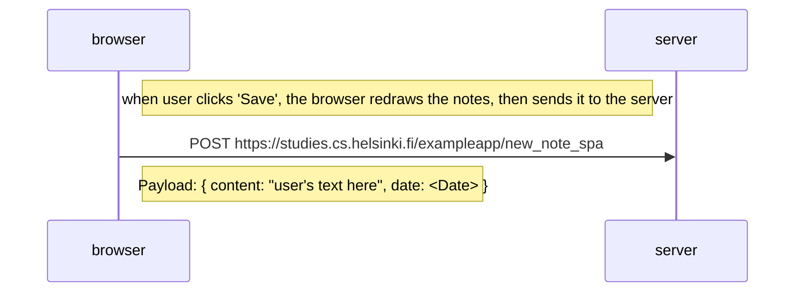

```mermaid
sequenceDiagram
    participant browser
    participant server

    Note right of browser: when user clicks 'Save', the browser redraws the notes, then sends it to the server
    browser->>server: POST https://studies.cs.helsinki.fi/exampleapp/new_note_spa
    Note right of browser: Payload: { content: "user's text here", date: <Date> }
```
